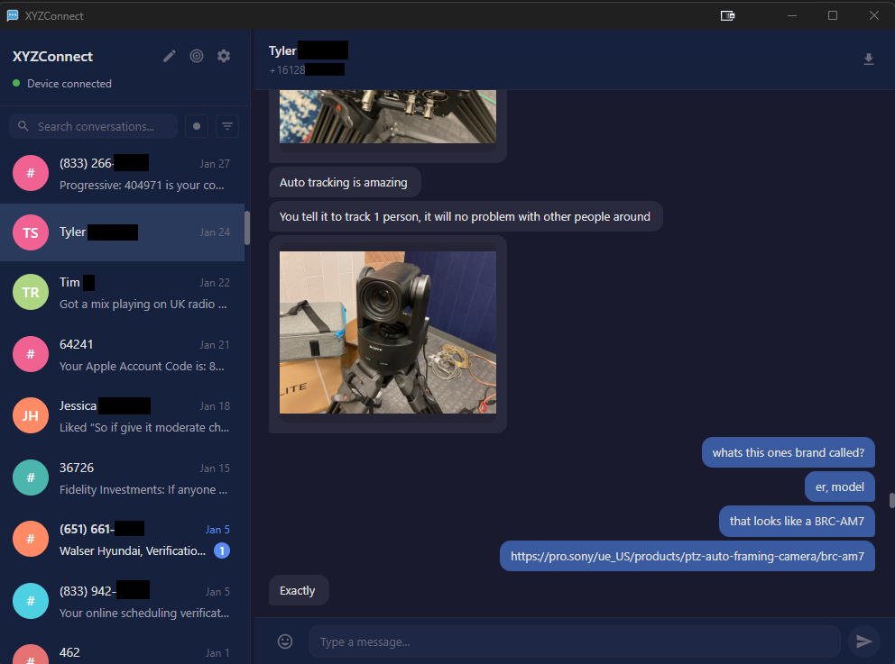

<h1 align="center">FossLink</h1>

<p align="center">A free and open source desktop SMS/MMS client for Android.<br>Send and receive text messages from your computer over your local network — no cloud, no account, no phone number sharing.</p>

<p align="center">
  <a href="docs/screenshot.png"></a>
</p>

## Features

- **Send and receive SMS/MMS** — Full two-way texting with photo, video, and audio attachments
- **Contact sync** — Names and photos pulled from your phone's contacts
- **Phone gallery** — Browse and download photos and videos from your phone's camera roll
- **Spam filter** — Hides unknown senders and short codes; surfaces verification messages
- **One-click verification codes** — Copy 2FA codes from messages with a single click
- **Desktop notifications** — Get notified of new messages with taskbar flash
- **Find my phone** — Ring your phone from your desktop
- **WebDAV file access** — Mount your phone's storage as a network drive
- **Cross-platform** — Windows, Linux, and macOS
- **Local network only** — All communication stays on your LAN. Nothing leaves your network.

## How It Works

FossLink communicates directly with the [FossLink Android companion app](https://github.com/hansonxyz/fosslink-android) over your local network. Your phone and computer discover each other via UDP broadcast, establish an encrypted WebSocket connection, and exchange messages peer-to-peer. No internet connection is required after initial setup.

## What Makes It Different

Most desktop SMS solutions require cloud relay services, Google accounts, or proprietary apps. FossLink is:

- **Fully local** — Messages never leave your network. No cloud, no relay servers, no accounts.
- **Free and open source** — Licensed under the MIT License.
- **Works with an open protocol** — Uses a simple WebSocket-based protocol, not a proprietary API.

## Getting Started

1. Install [FossLink](https://github.com/hansonxyz/fosslink-android/releases/latest) on your Android phone
2. Install FossLink on your computer (see [Downloads](#downloads) or build from source)
3. Ensure both devices are on the same local network
4. Pair when prompted — that's it

## Downloads

Pre-built installers are available from the [latest release](https://github.com/hansonxyz/fosslink-desktop/releases/latest):

- **Windows** — [FossLink Setup (.exe)](https://github.com/hansonxyz/fosslink-desktop/releases/latest/download/FossLink-Setup-1.0.0.exe)
- **Linux** — [AppImage](https://github.com/hansonxyz/fosslink-desktop/releases/latest/download/FossLink-1.0.0.AppImage) | [.deb](https://github.com/hansonxyz/fosslink-desktop/releases/latest/download/fosslink-gui_1.0.0_amd64.deb)
- **macOS** — Coming soon

## Building From Source

See [BUILD.md](BUILD.md) for full prerequisites and build instructions.

```bash
# Install dependencies
npm install
cd gui && npm install

# Dev build (Windows, unpacked)
npm run build:win

# Release installer
npm run release:win    # Windows
npm run release:linux  # Linux
npm run release:mac    # macOS
```

## Tech Stack

- **Electron** + **Svelte 5** — Desktop UI with reactive components
- **TypeScript** — Strict mode throughout
- **better-sqlite3** — Local message and contact database
- **Pino** — Structured logging
- **FFmpeg** — Video transcoding and thumbnail generation (bundled)

## Project Structure

| Path | Description |
|------|-------------|
| `src/` | Daemon: protocol, networking, database, IPC |
| `gui/` | Electron app: main process, preload, Svelte renderer |
| `tests/` | Unit and integration tests (Vitest) |
| `docs/` | Architecture docs |
| `BUILD.md` | Build prerequisites and instructions |
| `CONTRIB.md` | Credits and third-party attribution |
| `LICENSE` | MIT License |

## License

Licensed under the [MIT License](LICENSE).

## Acknowledgments

See [CONTRIB.md](CONTRIB.md) for full attribution.
